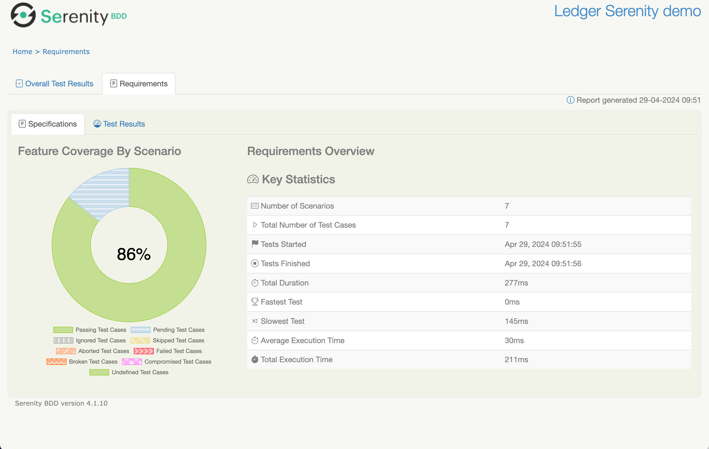

# Serenity JUnit Starter project

Get started quickly with Serenity BDD and JUnit 5 with this simple starter project. 

Illustrates how to write a simple Serenity BDD test using JUnit 5 and [SBT serenity plugin](https://github.com/cheleb/sbt-serenity/).


## Running the tests

To run the tests, you can use the following commands:

```bash
sbt test
```
## Viewing the reports

Both of the commands provided above will produce a Serenity test report in the `target/site/serenity` directory. Go take a look!

```bash
open target/site/serenity/index.html
```


